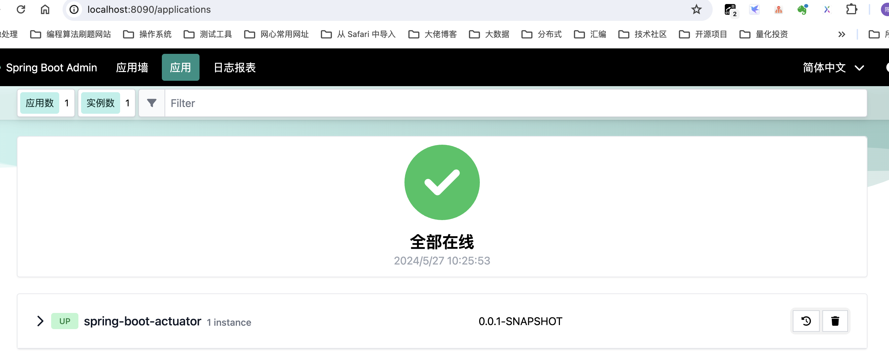
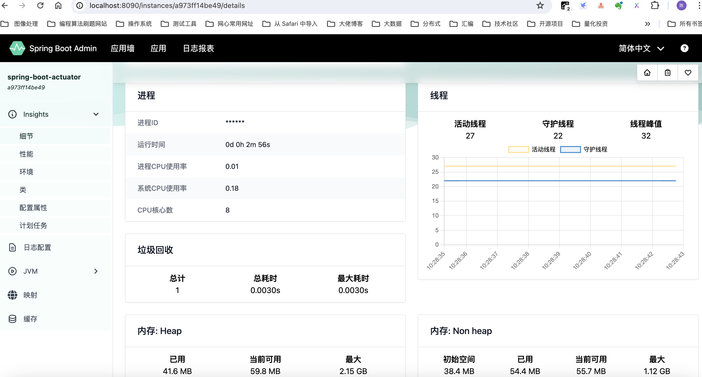

# Spring Boot Admin 监控

## Spring Boot Admin 服务端创建

1. 添加 Spring Boot Admin Server starter 到 pom.xml 依赖

   ```xml
   <dependency>
               <groupId>de.codecentric</groupId>
               <artifactId>spring-boot-admin-starter-server</artifactId>
   </dependency>
   ```

   

2. 添加 @EnableAdminServer 注解

   ```java
   @SpringBootApplication
   @EnableAdminServer
   public class SpringBootAdminApplication {
   
       public static void main(String[] args) {
           SpringApplication.run(SpringBootAdminApplication.class, args);
       }
   }
   ```


## Spring Boot Admin Client 创建

客户端注册到 admin 服务端，主要有两种方式

- 手动填写 admin 服务端的 ip+port
- 通过服务注册、发现服务来注册

这里主要介绍第一种方式。

1. 添加 spring-boot-admin-starter-cilent 依赖到 pom.xml

   ```xml
   <dependency>
       <groupId>de.codecentric</groupId>
       <artifactId>spring-boot-admin-starter-client</artifactId>
       <version>3.2.3</version>
   </dependency>
   ```

2. 配置 admin 服务端地址，以及打开对应的 actuator 的暴露 url

   ```yaml
   spring:
     application:
       name: spring-boot-actuator
     boot:
       admin:
         client:
           url: http://localhost:8090
   management:
     endpoint:
       health:
         show-details: always
     endpoints:
       web:
         exposure:
           include: '*'
   
     info:
       build:
         enabled: true
       env:
         enabled: true
       git:
         enabled: true
         mode: full
   ```


最后看下效果图






