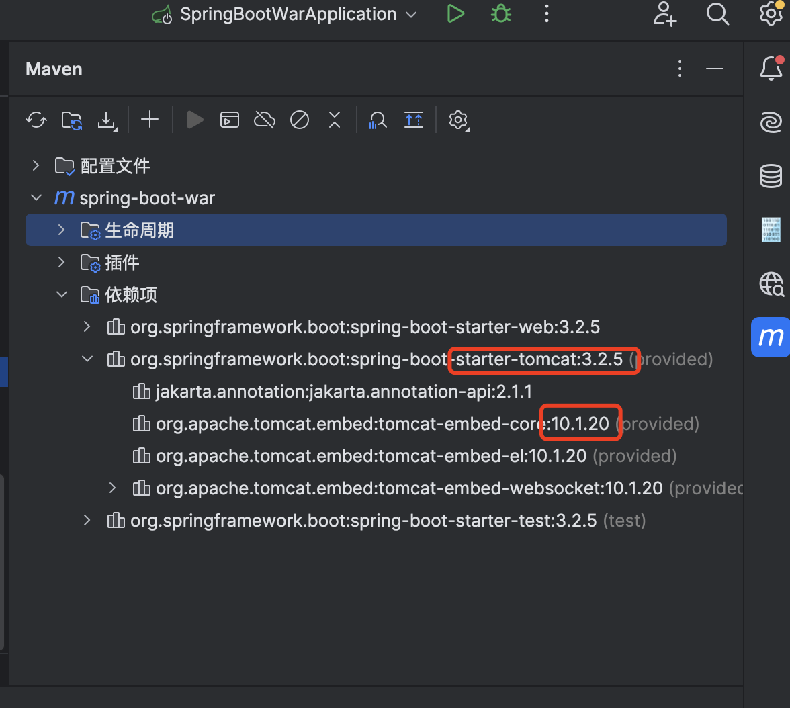
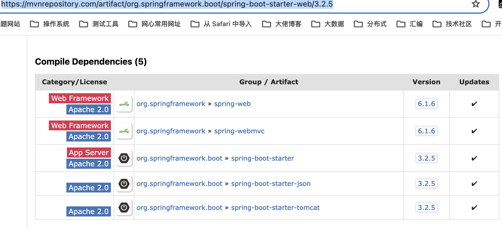

# Getting Started

### 修改打包方式

```
<packaging>war</packaging>
```


### 修改 Servlet 容器的 scope

```
<dependency>
            <groupId>org.springframework.boot</groupId>
            <artifactId>spring-boot-starter-tomcat</artifactId>
            <scope>provided</scope>
        </dependency>
```

由于我们会使用外部的 Tomcat，所以需要主动把嵌入式容器 `spring-boot-starter-tomcat` 依赖的 `scope` 声明为 `provided`，表示该依赖只用于编译、测试。


### 新增一个继承类

```java
package org.example.springbootwar;

import org.springframework.boot.builder.SpringApplicationBuilder;
import org.springframework.boot.web.servlet.support.SpringBootServletInitializer;

public class ServletInitializer extends SpringBootServletInitializer {

    @Override
    protected SpringApplicationBuilder configure(SpringApplicationBuilder application) {
        return application.sources(SpringBootWarApplication.class);
    }
}
```

我们需要继承 `SpringBootServletInitializer` 类并覆写其 `configure(SpringApplicationBuilder application)` 方法，通过该方法指定 `@SpringBootApplication` 所在类。


### 修改打包名称

```xml
 <build>      
       <finalName>spring-boot-war</finalName>
 </build>
```


### 使用 mvn 打包

```
# 先执行 clean，再执行 package，并且跳过测试用例的执行
mvn clean package -Dmaven.test.skip=true
```


### 部署到 tomcat 

将打包好的 target/spring-boot-war.war包部署到 tomcat 的 webapp目录下。


### 访问对应springboot项目

```
// spring-boot-war 是 webapp目录下的包名，作为项目的根目录
curl 'http://120.0.0.1/spring-boot-war/test'
```


### 注意：

如果部署成功，但Spring Boot 没有启动日志，并且访问 404，则可能有 tomcat 的版本和 spring-boot的版本不一致。

需要查看 spring-boot-starter-web 对应的 内置tomcat 的版本。可以通过一下几个方法查看：

- 查看依赖

  在 idea 中查看对应的 版本

  

- 到 mvnrepository 仓库中查看

  ```
  https://mvnrepository.com/artifact/org.springframework.boot/spring-boot-starter-web/3.2.5
  ```

  
